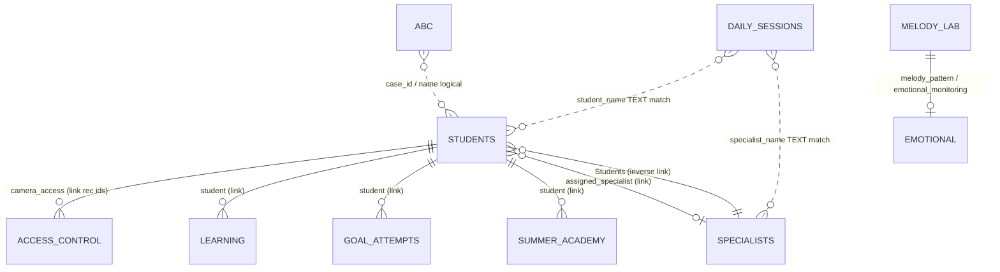

# الجزء 7 — قاعدة البيانات والمنطق (نسخة كاملة للتطوير)

> منصة عونك الأصلية · Aunak Core · يوليو 2026  
> **هذه الوثيقة وحدها كافية لفهم Airtable والمنطق — المرجع التقني:** `src/lib/airtableFields.js` · `src/lib/airtableTables.js` · `docs/AIRTABLE_SCHEMA_PROTOCOL.md`

---

## 7.1 نظرة عامة

| Property | Value |
|----------|-------|
| **المخزن** | Airtable REST API v0 |
| **Base ID (إنتاج)** | `appaGfKj4vYhMw0cb` |
| **الإنتاج** | https://aunak.vercel.app |
| **العميل** | `src/lib/airtable.js` |
| **أسماء الأعمدة** | snake_case إنجليزي فقط — **لا** overrides عبر env |
| **قيم Select** | lowercase: `new`, `active`, `pending`, `approved`, … |
| **ORM** | لا يوجد — `airtableMappers.js` يحوّل إلى كائنات JS |
| **البروكسي** | `VITE_USE_AIRTABLE_PROXY=true` → `/api/airtable` (PAT على الخادم) |

### أنواع المعرّفات (IDs)

| النوع | الشكل | الاستخدام |
|-------|-------|-----------|
| **Base ID** | `app` + 14 حرف | `appaGfKj4vYhMw0cb` — القاعدة كلها |
| **Table ID** | `tbl` + 14 حرف | في URL: `/v0/{baseId}/{tableId}` |
| **Record ID** | `rec` + 14 حرف | PATCH/GET سجل واحد — **هذا ما يُمرَّر كـ `studentId` في APIs** |
| **Student code** | `student_id` حقل نص | كود أعمال مثل `AUN-…` — **ليس** record id |
| **Device tokens** | `AUN-{PRT\|CHD\|SPC}-{32hex}` | دخول الأجهزة الثلاثة بعد التفعيل |

> **قاعدة ذهبية:** `req.body.studentId` في `/api/activation/redeem` = **record id** (`rec…`) وليس `student_id`.

---

## 7.2 جدول IDs — كل الجداول

| Key (كود) | Table ID (إنتاج) | Env override | Hub section |
|-----------|------------------|--------------|-------------|
| `students` | `tblzYmBGmCxx2vdcr` | `VITE_AIRTABLE_STUDENTS_TABLE_ID` | السجل الحي، الجلسات، التشخيص، البصمة |
| `dailySessions` | `tbl3mlewMLvqp6AXB` | `VITE_AIRTABLE_DAILY_SESSIONS_TABLE_ID` | تسوية الجلسات / Sealed claims |
| `accessControl` | `tblfBvd5WI7alVCFU` | — | التحكم في الوصول |
| `specialists` | `tblnmcLd5M3U6sErl` | `VITE_AIRTABLE_SPECIALISTS_TABLE_ID` | الأخصائيين |
| `abcData` | `tblJ580ptTVkv07hD` | — | تعديل السلوك ABC |
| `learningDifficulties` | `tblcNXSmU90TomEHH` | — | صعوبات التعلّم |
| `emotionalMonitoring` | `tblokLHmSHss3FQft` | — | الرصد العاطفي / الدرع الذكي |
| `scientificItems` | `tblnCbBSmwDWwO5SJ` | — | مكتبة البنود |
| `safeMedia` | `tbljdOSE8CozrzBZN` | — | مكتبة الوسائط |
| `melodyLab` | `tblMddsXqCz91hfoU` | — | مختبر الألحان |
| `communityResources` | `tblV28iWarzve32pP` | — | موارد المجتمع |
| `goalAttempts` | *(فارغ — يُنشأ يدوياً)* | `VITE_AIRTABLE_GOAL_ATTEMPTS_TABLE_ID` | محاولات الأهداف |
| `summerAcademy` | *(فارغ — يُنشأ يدوياً)* | `VITE_AIRTABLE_SUMMER_ACADEMY_TABLE_ID` | الأكاديمية الصيفية |

**Env إضافية:**

| Variable | Purpose |
|----------|---------|
| `VITE_AIRTABLE_BASE_ID` / `AIRTABLE_BASE_ID` | Base ID |
| `AIRTABLE_API_KEY` / `VITE_AIRTABLE_PAT` | PAT — **خادمياً فقط في الإنتاج** |
| `VITE_USE_AIRTABLE_PROXY` | `true` = كل الكتابة عبر `/api/airtable` |

---

## 7.3 Students — `tblzYmBGmCxx2vdcr` (الجدول المحوري)

### 7.3.1 كل الحقول

| Field | Type | Select / Format | Meaning |
|-------|------|-----------------|---------|
| `student_name` | text | — | اسم الطالب (اسمين+) |
| `student_id` | text | `AUN-…` | كود الطالب (business key) |
| `age` | number | 2–18 | العمر |
| `diagnosis` | select | انظر §7.14 | التشخيص |
| `parent_phone` | phone/text | — | جوال ولي الأمر |
| `parent_country_code` | text | e.g. `966` | كود الدولة |
| `preferred_destination` | select | media, registry, community, diagnostics | الوجهة بعد التفعيل |
| `status` | select | new, active | حالة التسجيل |
| `subscription_status` | select | pending → active | **بوابة البصمة والاشتراك** |
| `plan_code` | select | free, tutor, medical, institution, assessment_only | الباقة |
| `subscription_expires_at` | date | +30 يوم من redeem | انتهاء الاشتراك |
| `last_payment_at` | datetime | ISO | آخر دفع |
| `payment_method` | text | e.g. `manual_code`, Tap | طريقة الدفع |
| `activation_code_used` | text | `AUN-TUTOR-XXXX-YYYY` | آخر كود مُفعَّل |
| `payment_status` | text/select | — | حالة الدفع |
| `session_fee` | number | — | مستحقات الجلسة |
| `face_biometric` | long text | JSON `[128 floats]` | بصمة الوجه |
| `biometric_status` | select | approved | حالة البصمة |
| `camera_access` | **link** | → Access Control | صلاحيات الكاميرا |
| `biometric_attendance_verified` | checkbox | AUN-4611 | حضور بيومتري |
| `biometric_attendance_at` | datetime | — | وقت الحضور |
| `initial_assessment_score` | number | 0–100 | التقييم المجاني |
| `comprehensive_assessment_status` | select | not_started, in_progress, completed | التقييم الشامل |
| `parent_access_token` | text | AUN-PRT-{32hex} | جهاز الأهل |
| `child_interactive_token` | text | AUN-CHD-{32hex} | جهاز الطفل |
| `specialist_tutor_token` | text | AUN-SPC-{32hex} | جهاز الأخصائي |
| `harmony_score` | number | 0–100 | درجة التناغم |
| `academic_progress` | number | 0–100 | التقدم الأكاديمي |
| `behavior_intensity` | number | 0–100 | شدة السلوك |
| `focus_level` | number | 0–100 | التركيز |
| `t_static` | number | seconds | الشرود |
| `eye_movement_map` | long text | JSON/text | خريطة العين |
| `programmed_goal` | long text | — | الهدف الإجرائي |
| `improvement_index` | number | — | مؤشر التحسن |
| `operating_efficiency` | number | — | كفاءة التشغيل |
| `zero_point_report` | long text | — | تقرير نقطة الصفر |
| `assigned_class` | text | — | الفصل |
| `session_start_time` | text/datetime | — | وقت بدء الجلسة |
| `clinical_session_status` | text/select | e.g. `live` | حالة الجلسة السريرية |
| `clinical_session_notes` | long text | مشفّر اختياري | ملاحظات الجلسة |
| `smart_session_fields` | number | **66** | عدد حقول الجلسة الذكية |
| `ai_session_report` | long text | — | تقرير AI مختصر |
| `assigned_specialist` | **link** | → Specialists | *(جسر Tawasul — اختياري)* |
| `mirror_command` | select/text | echo_goal, drop_star, … | *(Ghost Mirror — Tawasul)* |
| `mirror_payload` | text | — | *(Ghost Mirror — Tawasul)* |

---

## 7.4 Daily Sessions — `tbl3mlewMLvqp6AXB`

| Field | Type | Notes |
|-------|------|-------|
| `session_date` | date | YYYY-MM-DD |
| `specialist_name` | text | **ربط منطقي** — ليس link |
| `student_name` | text | **ربط منطقي** — ليس link |
| `notes` | long text | ملاحظات التسوية |
| `claim_status` | select | **`Sealed`** = مختوم |
| `sealed_at` | datetime | وقت الختم |
| `specialist_signature` | long text | JSON HMAC |
| `immutable_hash` | text | hash للتحقق |
| `session_sequence` | number | تسلسل الجلسة |
| `pin_verified` | checkbox | PIN الأخصائي |

---

## 7.5 Access Control — `tblfBvd5WI7alVCFU`

| Field | Type | Select |
|-------|------|--------|
| `user_email` | email | — |
| `user_name` | text | — |
| `status` | select | active |
| `permissions` | text | e.g. `camera_biometric` |
| `access_level` | select | parent, admin, specialist |
| `access_areas` | long text | — |
| `access_token` | text | login token |
| `last_login` | datetime | — |

---

## 7.6 Specialists — `tblnmcLd5M3U6sErl`

| Field | Type | Notes |
|-------|------|-------|
| `specialist_name` | text | |
| `specialty` | select | |
| `professional_email` | email | مفتاح PIN / تسوية |
| `contact_phone` | phone | |
| `admin_notes` | long text | editable sovereign |
| `status` | select | |
| `active_cases` | number | |
| `rating` | number | |
| `specialist_tutor_token` | text | AUN-SPC-… |
| `Students` | **link** | → Students (caseload — Tawasul) |

---

## 7.7 Goal Attempts — *(جدول اختياري)*

| Field | Type | Link |
|-------|------|------|
| `student` | link | → Students |
| `session_id` | text | dynamic session id |
| `session_date` | date | |
| `goal_label` | text | |
| `goal_source` | select | IEP / ABC / Learning |
| `success_percent` | number | 0–100 |
| `attempt_number` | number | |
| `specialist_email` | email | |
| `attempt_notes` | text | |
| `recorded_at` | datetime | |

---

## 7.8 Summer Academy — *(جدول اختياري)*

| Field | Type |
|-------|------|
| `student` | link → Students |
| `student_name` | text |
| `event_type` | select |
| `track` | text |
| `silent_level` | number |
| `baseline_level` | number |
| `current_level` | number |
| `weak_points_json` | long text |
| `daily_xp` | number |
| `tasks_completed` | number |
| `total_xp` | number |
| `progress_json` | long text |
| `recorded_at` | datetime |
| `session_date` | date |

---

## 7.9 Sector Tables — حقول كاملة

### ABC — `tblJ580ptTVkv07hD`

| Field | Type |
|-------|------|
| `case_id` | number |
| `programmed_goal` | long text |
| `behavior` | long text |
| `status` | select |
| `intensity` | select/number |
| `crisis_score` | number |
| `risk_label` | select |

### Learning Difficulties — `tblcNXSmU90TomEHH`

| Field | Type | Link |
|-------|------|------|
| `student` | link | → Students |
| `programmed_goal` | long text | |
| `t_static` | number | |
| `focus_level` | number | |
| `academic_progress` | number | |
| `intervention_notes` | long text | |
| `weekly_milestone` | text | |

### Emotional Monitoring — `tblokLHmSHss3FQft`

| Field | Type | Link |
|-------|------|------|
| `mood_label` | text | |
| `score` | number | |
| `intelligence_insight` | long text | |
| `preferred_pattern` | checkbox | |
| `melody_pattern` | link | → Melody Lab |

### Scientific Items — `tblnCbBSmwDWwO5SJ`

| Field | Type |
|-------|------|
| `title` | text |
| `category` | select |
| `weight` | number |
| `usage_count` | number |

### Safe Media — `tbljdOSE8CozrzBZN`

| Field | Type |
|-------|------|
| `title` | text |
| `category` | select |
| `duration` | text |
| `encrypted` | checkbox |

### Melody Lab — `tblMddsXqCz91hfoU`

| Field | Type | Link |
|-------|------|------|
| `pattern_id` | text | |
| `pattern_name` | text | |
| `description` | long text | |
| `score` | number | |
| `face_au` | text | |
| `emotional_monitoring` | link | → Emotional Monitoring |

### Community Resources — `tblV28iWarzve32pP`

| Field | Type |
|-------|------|
| `title` | text |
| `resource_type` | select |
| `audience` | select |
| `downloads` | number |
| `rating` | number |
| `summary` | long text |

---

## 7.10 العلاقات ومفاتيح الربط



### روابط Airtable رسمية (Link fields)

| From table | Field | To table | Value shape |
|------------|-------|----------|-------------|
| Students | `camera_access` | Access Control | `["recXXX", …]` |
| Students | `assigned_specialist` | Specialists | `["recXXX"]` |
| Learning | `student` | Students | `["recXXX"]` |
| Goal Attempts | `student` | Students | `["recXXX"]` |
| Summer Academy | `student` | Students | `["recXXX"]` |
| Specialists | `Students` | Students | `["recXXX", …]` |
| Melody Lab | `emotional_monitoring` | Emotional | `["recXXX"]` |
| Emotional | `melody_pattern` | Melody Lab | `["recXXX"]` |

### روابط منطقية (نص — **ليست** Link في Airtable)

| From | Fields | Match by |
|------|--------|----------|
| Daily Sessions | `specialist_name`, `student_name` | اسم النص = `student_name` / `specialist_name` |
| ABC | `case_id`, `programmed_goal` | رقم الحالة أو اسم الطالب في UI |
| Harmony engine | Students + Learning + ABC | `student.id` (rec) + fetch related rows |

---

## 7.11 من يقرأ ماذا (Read Matrix)

| الجدول | القارئ (ملف / مكوّن) | طريقة |
|--------|----------------------|-------|
| **Students** | `fetchStudents()` — كل الـ Hub، Auth، Enrollment، Child، Parent | `fetchAirtableRecords(students)` + `mapStudent` |
| **Students** | `findStudentByIdentifier` — Gate، Login | filter على name / student_id / tokens |
| **Students** | `auth.jsx` | login + session bootstrap |
| **Daily Sessions** | `fetchDailyClaimsForDate`, `getDailyReconciliation` | filterByFormula + تاريخ |
| **Daily Sessions** | `api/parent/sessions.js` | server-side PAT |
| **Access Control** | `AunakAccessControl.jsx`, `auth.jsx`, `fetchAccessControlByEmail` | full table fetch |
| **Specialists** | `AunakSpecialists.jsx`, `useAirtableData` | read-only UI |
| **ABC** | `AunakBehaviorMod.jsx`, `AunakCrisisManagement.jsx`, `useHarmonyEngine` | read-only UI |
| **Learning** | `AunakLearningCenter.jsx`, `useHarmonyEngine`, `AunakResearchHub` | read-only UI |
| **Emotional** | `AunakEmotion.jsx`, `AunakEmotionalLab.jsx`, Research | read-only UI |
| **Scientific** | `AunakScientificItems.jsx` | read-only UI |
| **Safe Media** | `AunakSafeMedia.jsx`, `useSummerAcademy` | read-only UI |
| **Melody** | `AunakEmotionalLab.jsx` | read-only UI |
| **Resources** | `AunakResources.jsx` | read-only UI |
| **Goal Attempts** | `fetchSessionGoalAttempts`, `fetchWeeklyGoalAttempts` | formula أو localStorage |
| **Summer Academy** | `summerAcademyAirtable.js`, `useSummerAcademy` | POST read-back أو localStorage |

> **Sector tables (ABC, Media, …):** القراءة فقط من الواجهة — **لا PATCH** من React hub في الكود الحالي.

---

## 7.12 من يكتب ماذا (Write Matrix)

### Students — POST (إنشاء)

| Actor | Trigger | Fields written |
|-------|---------|----------------|
| `AunakEnrollment.jsx` | Step 1 submit | `createStudentRecord(buildStudentEnrollmentFields(...))` → name, age, diagnosis, status=`new`, subscription_status=`pending`, parent_phone, parent_country_code, student_id, preferred_destination |
| `buildStudentEnrollmentFields` | `airtable.js` | يولّد `student_id` فريد عبر `generateUniqueStudentCode` |

### Students — PATCH (تعديل)

| Actor | Trigger | Fields |
|-------|---------|--------|
| `saveInitialAssessmentScore` | Free assessment done | `initial_assessment_score`, `comprehensive_assessment_status=not_started` |
| `POST /api/activation/redeem` | Activation code OK | `subscription_status=active`, `plan_code`, `last_payment_at`, `payment_method`, `subscription_expires_at`, `preferred_destination`, `activation_code_used`, **triple tokens**, `comprehensive_assessment_status` (unless already completed) |
| `subscriptionEngine.redeemActivationCode` | Client fallback redeem | نفس حقول الاشتراك + tokens |
| `paymentWebhookProcessor` | Tap CAPTURED | subscription fields + tokens (مثل redeem) |
| `saveStudentFaceBiometric` | Post-pay biometric | `face_biometric`, `biometric_status=approved` |
| `promoteStudentStatus` | After enroll | `status=active`, `subscription_status=pending` |
| `createCameraAccessPermission` | Biometric gate | **Access Control POST** ثم Students PATCH `camera_access=[recPermission]` |
| `initializeSovereignSessionRegistry` | Sovereign login match | `session_start_time`, `clinical_session_status=live`, `smart_session_fields=66`, `biometric_attendance_verified`, `biometric_attendance_at` |
| `applyHarmonyLoginDeduction` / `syncHarmonyToAirtable` | Login / refresh | `harmony_score` |
| `AunakSessionRegistry.jsx` | Save notes | `clinical_session_notes` (encrypted optional) |
| `AunakSessionRegistry.jsx` | Settlement confirm | `biometric_attendance_verified=true` + **Daily Sessions POST** (sealed) |
| `harmonyEngine.refreshStudentHarmony` | Harmony refresh | `harmony_score` (computed) |

### Daily Sessions — POST only

| Actor | Trigger | Fields |
|-------|---------|--------|
| `createSealedSessionClaim` | Session settlement | `session_date`, `specialist_name`, `student_name`, `notes`, `claim_status=Sealed`, `sealed_at`, `session_sequence`, `immutable_hash`, `pin_verified`, `specialist_signature` |
| `createDailySessionDraft` | Pre-seal draft | same without seal fields |
| Fallback | no table id | `localStorage` key `aunak.dailySessions.v1` |

### Access Control — POST

| Actor | Trigger | Fields |
|-------|---------|--------|
| `createCameraAccessPermission` | Camera unlock | `user_name`, `status=active`, `permissions=camera_biometric`, `access_level=parent` |

### Specialists — PATCH

| Actor | Trigger | Fields |
|-------|---------|--------|
| `updateSpecialistRecord` | Admin sovereign edit | `admin_notes`, … (any passed fields) |

### Goal Attempts — POST

| Actor | Trigger | Fields |
|-------|---------|--------|
| `createGoalAttempt` | Goal logging | all GA fields + `student=[recId]`; fallback `aunak.goalAttempts.v1` |

### Summer Academy — POST

| Actor | Trigger | Fields |
|-------|---------|--------|
| `summerAcademyAirtable.js` | XP / progress events | student link + xp fields; fallback localStorage |

---

## 7.13 قواعد الحذف (Delete Rules)

| Rule | Detail |
|------|--------|
| **لا DELETE في الكود** | المنصة **لا** تستدعي `DELETE` على Airtable أبداً — لا `deleteRecord` في `src/` أو `api/` |
| **Sealed = append-only** | سجل `claim_status=Sealed` **لا يُعدَّل** — `assertClaimNotSealed()` → `CLAIM_SEALED_IMMUTABLE` |
| **Server seal guard** | `POST /api/settlement/seal` يرفض PATCH على claims مختومة |
| **localStorage** | backups تُ append فقط — لا purge إلا يدوياً من المتصفح |
| **حذف Airtable يدوي** | خارج نطاق التطبيق — يكسر الربط بالـ rec ids في `camera_access` |

---

## 7.14 قواعد التعديل (Edit Rules)

| Rule | Enforcement |
|------|-------------|
| **Biometric blocked until paid** | `subscription_status !== active` → `PostActivationBiometric` لا يُعرض؛ الكاميرا محجوبة |
| **Empty scrub** | `scrubFields()` يحذف `null`/`""`/`undefined` قبل POST/PATCH |
| **typecast: true** | كل كتابة — Airtable ينشئ select options إن أمكن |
| **Select must exist** | قيمة غير موجودة → `SELECT_OPTION_MISSING` / `INVALID_MULTIPLE_CHOICE_OPTIONS` |
| **Unknown field** | عمود ناقص → `UNKNOWN_FIELD_NAME` |
| **Sealed immutability** | PATCH على Daily Session مختوم → throw |
| **Face uniqueness** | قبل حفظ `face_biometric`: `assertFaceUniqueInRegistry()` ≥94.7% → `FACE_DUPLICATE_BLOCKED` |
| **Enrollment match** | Enrollment verify: **82%**؛ Sovereign login: **94.7%** |
| **Harmony deduction** | Login: −20% ثم gap penalty إذا \|academic−behavior\| ≥ 20 |
| **Tokens** | تُولَّد **مرة واحدة** عند redeem — `tripleAccessProtocol.js` |
| **66 session fields** | `smart_session_fields=66` عند فتح registry |
| **Sector tables read-only** | ABC/Media/… — التعديل من Airtable UI أو مستقبلاً — ليس من Hub React حالياً |

### Select options — يجب وجودها في Airtable

```
status: new, active
subscription_status: pending, active
preferred_destination: media, registry, community, diagnostics
biometric_status: approved
plan_code: free, tutor, medical, institution, assessment_only
comprehensive_assessment_status: not_started, in_progress, completed
diagnosis: autism_spectrum, adhd, learning_difficulty, language_delay, under_assessment
access_control status: active
access_level: parent, admin, specialist
daily_sessions claim_status: Sealed
```

---

## 7.15 Student Object (بعد mapStudent)

```javascript
{
  id,                    // recXXXXXXXX — Airtable record id
  name, studentCode,     // studentCode ← student_id field
  age, diagnosis, status,
  subscriptionRaw, plan,
  faceBiometric, harmonyScore, academicProgress,
  behaviorIntensity, focusLevel, programmedGoal,
  preferredDestination, cameraAccessIds,   // parsed from camera_access link
  parentAccessToken, childInteractiveToken, specialistTutorToken,
  initialAssessmentScore, comprehensiveAssessmentStatus,
  fields: { ...raw Airtable fields }
}
```

---

## 7.16 Session Object (Auth — useAuth)

```javascript
{
  role, plan, name, email, recordId, childId, childName,
  dynamicSessionId, landingSection, activeTab,
  biometricSovereign, subscriptionActivated, subscriptionRaw,
  assessmentOnlyMode, activeStudentId,
  sessionRegistryOpen, sessionStartedAt, ...
}
```

---

## 7.17 APIs — Production Core

| Endpoint | Method | Writes Airtable? | Purpose |
|----------|--------|------------------|---------|
| `/api/airtable?table=tbl…` | GET/POST/PATCH | ✅ | Proxy — PAT hidden |
| `/api/activation/redeem` | POST | ✅ Students PATCH | Code → active + tokens |
| `/api/payment?action=create-checkout` | POST | ❌ | Tap charge URL |
| `/api/payment?action=webhook` | POST | ✅ via processor | Tap → activate |
| `/api/payment?action=verify-return` | GET | maybe | Return page |
| `/api/payment?action=status` | GET | ❌ | Config check |
| `/api/session/child-seal` | POST | ❌* | Child play seal ack |
| `/api/settlement/seal` | POST | ❌ | Validates immutability |
| `/api/parent/sessions` | GET | ❌ | Parent ledger read |
| `/api/academy/tts` | POST | ❌ | ElevenLabs proxy |

\* child-seal may trigger client-side Daily Session create

**Router:** `api/payment/[action].js` → `createActionRouter`

---

## 7.18 Data Access Patterns

### Read pipeline
```
Component/Hook
  → fetchAirtableRecords(tableId)
      → try view "Grid view" → fallback no view
      → pagination (offset)
      → mapStudent / inline map
      → render
```

### Write pipeline
```
airtableWrite(POST|PATCH)
  → typecast: true
  → scrubFields
  → proxy OR direct (fallback)
  → formatAirtableWriteError on 422
```

### Proxy vs Direct
```
VITE_USE_AIRTABLE_PROXY=true  →  /api/airtable (server PAT) ✅ production
else                          →  api.airtable.com (PAT in bundle) ⚠️ dev only
```

### localStorage Fallbacks

| Key | When used |
|-----|-----------|
| `aunak.dailySessions.v1` | Daily Sessions backup / offline |
| `aunak.goalAttempts.v1` | no `goalAttempts` table id |
| `aunak.activationCodes.v1` | local code store (dev) |
| summer academy keys | no `summerAcademy` table id |

---

## 7.19 Pricing (Server-side SAR)

**File:** `src/lib/paymentPlans.js`

| Plan | Price (SAR) |
|------|-------------|
| tutor | 299 |
| medical | 499 |
| assessment_only | 199 |
| institution | manual |

**Activation code format:** `AUN-{FREE|TUTOR|MEDICAL|INST|ASSESS}-{4chars}-{4digits}`

---

## 7.20 Enrollment → Payment → Biometric (Data Flow)

```
1. POST Students        status=new, subscription_status=pending
2. PATCH Students       initial_assessment_score (free assessment)
3. POST /activation/redeem OR payment webhook
                        subscription_status=active, plan_code, tokens×3
4. PATCH Students       face_biometric + biometric_status=approved
                        (ONLY if subscription_status=active)
5. Sovereign login      harmony_score, session registry fields
6. Settlement           POST Daily Sessions (Sealed) — immutable
```

---

## 7.21 ملفات مرجعية في الشفرة

| File | Role |
|------|------|
| `src/lib/airtableFields.js` | **مصدر الحقيقة** لأسماء الأعمدة |
| `src/lib/airtableTables.js` | Table IDs + hub mapping |
| `src/lib/airtable.js` | fetch/write/helpers |
| `src/lib/airtableMappers.js` | record → JS objects |
| `src/lib/tripleAccessProtocol.js` | token generation |
| `src/lib/biometricMatch.js` | 94.7% / 82% thresholds |
| `src/lib/enrollmentValidation.js` | step-1 validation |
| `docs/AIRTABLE_SCHEMA_PROTOCOL.md` | protocol + checklist |

---

## 7.22 ما **لا** يشمله هذا الجزء (مسارات منفصلة)

| Track | Note |
|-------|------|
| **Tawasul MVP** | `api/tawasul/*`, `assigned_specialist`, mirror_* — فرع منفصل |
| **English Talk Island** | `student_english_token`, `/english` — فرع Maryam |
| **Philosophy docs** | `docs/philosophy/` — توثيق فقط |

---

*التالي: [الجزء 8 — المتبقي](./PART-08_REMAINING.md)*
