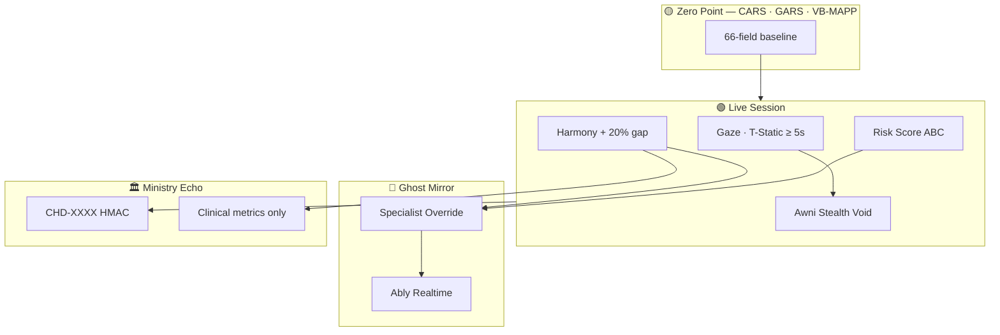

<div align="center">

# 🏛️ الدستور العيادي-الحسي لمنصة عونك

### *AUNAK Clinical & Sensory Manifesto*

---

**المعرّف:** `CONST-CLINICAL-001`  
**الإصدار:** 1.0 · **يوليو 2026**  
**المرتبة:** دستور سريري-حسي رسمي — يُفسَّر وفق `AUNAK_CONSTITUTION.md` · `003_AUNAK_CORE_PHILOSOPHY.md`  
**الإطار العلمي:** CARS-2 · GARS-3 · VB-MAPP · Sensory Integration · Neuro-diversity · ABC Functional Analysis

> *«ليس كل صمتٍ في الجلسة فشلاً — ولا كل سطرٍ في الجدول إنساناً.»*  
> — **المايسترو حازم** · 12 عاماً في التربية الخاصة والتكامل الحسي

</div>

---

## 📜 تمهيد: من ثلاثة مخطوطات إلى نظام واحد

هذا الدستور ليس وثيقة تسويقية، ولا دليلاً تقنياً للمطور وحده. إنه **الجسر السيادي** بين ثلاثة مخطوطات فلسفية — ومحركات عونك الحية في الشيفرة:

| المخطوط | المرجع الفلسفي | التجسيد التقني |
|---------|----------------|----------------|
| **I** | من البيانات الصماء إلى السيادة الحسية | `Child Journey Core` · `zeroPointSchema` · `harmonyEngine` |
| **II** | الفراغ المستنير · سكون المعنى | `ChildAwniCompanion` · `useGazeNeutralityObserver` · `sovereignAudio` |
| **III** | صمت السطور · صدى المعاني | `useMeltdownPredictor` · `b2gAnonymization` · `AunakLiveDashboard` |

> **🟡 الذهب السيادي** = كرامة الطفل · إيقاعه · بياناته المحمية  
> **🟢 الزمرد السريري** = التكيف الحي · التقدم القابل للقياس · الانسجام العصبي-سلوكي

---

## 🏛️ 1. فلسفة عونك: من البيانات الصماء إلى السيادة الحسيّة

### *The Clinical Paradigm Shift*

#### 1.1 تشخيص الأزمة: البرمجيات التقليدية

في أغلب أنظمة التربية الخاصّة الرقمية، يُختزل الطفل — ذو **Neuro-diversity** — إلى **صفوف باردة في جداول**: اسم، عمر، تشخيص، خانة «مكتمل / غير مكتمل». هذا النموذج:

- يعامل الطفل **كحالة** (`Case`) لا **كرحلة** (`Journey`) — خلافاً لما أقرّته فلسفة عونك في `002_لماذا_الطفل_رحلة_وليس_حالة.md`.
- يفصل **البيانات السلوكية** عن **الملف الحسي** (Sensory Profile)، فيُنتج تقارير «دقيقة إحصائياً» لكنها **صمّاء سريرياً**.
- يُحوّل الجلسة إلى **امتحان** يُقاس فيه «النجاح» بلحظة واحدة، لا بـ **التعميم** و**الثبات** عبر الزمن — كما عرّفته `003_AUNAK_CORE_PHILOSOPHY.md`.

> **النتيجة السريرية:** ازدواجية خطرة بين «تقدّم أكاديمي» و«شدة سلوكية» لا تُ reconciled إلا بعد فوات الأوان — أي بعد Meltdown أو انسحاب حسّي.

#### 1.2 البديل السيادي: النظام العصبي السيادي (*Neural Sovereign System*)

عونك لا تُدير «ملفاً»؛ بل تُدير **نظاماً عصبياً-سلوكياً متكاملاً** يحترم:

| المبدأ | التطبيق السريري | التطبيق التقني |
|--------|-----------------|----------------|
| **كرامة القاصر** | لا تشخيص نهائي من المنصة؛ الأدلة لا الانطباع | `sealedClaims` · `AunakDiagnostics` — CARS-2 / GARS-3 / VB-MAPP كـ **Zero Point** لا كحكم |
| **الإيقاع الإنساني** | الجلسة تتنفس مع الطفل لا ضدّه | `GAZE_HOLD_MS = 5000` · `MELTDOWN_LATENCY_MS = 280` |
| **الملف الحسي** | Sensory Integration كمتغيّر أول لا ثانوي | `focus_level` · `tStatic` · `behavior_intensity` في Airtable |
| **التكيف الديناميكي** | الخطة تُعاد صياغتها لا تُجمّد | `goalEngine` (AUN-4611) · `programmed_goal` |

#### 1.3 نقطة الصفر الذكية: 66 حلاً سريرياً

محرك **`zeroPointSchema.js`** — 66 حقلاً موزّعة على:

- **CARS-2** (15 بنداً) — Childhood Autism Rating Scale  
- **GARS-3** (14 بنداً) — Gilliam Autism Rating Scale  
- **VB-MAPP** (27 بنداً) — Verbal Behavior Milestones  
- **Meta** (10 حقول) — سياق الجلسة · baseline حسّي · ختم زمني

هذا ليس «استبياناً إلكترونياً»؛ بل **Baseline Neuro-clinical** يُغذّي كل محرك لاحق: Harmony · Goals · Mirror · B2G.

#### 1.4 الخلاصة الدستورية

> **🟡** عونك ترفض فلسفة «املأ الخانة».  
> **🟢** عونك تبني **سيادة حسّية**: كل قرار خوارزمي — حتمي (*deterministic*)، قابل للتدقيق، ومربوط بإيقاع الطفل لا بإيقاع الجدول.

---

## 🌌 2. بروتوكول «الفراغ المستنير» والتكيف الحسي الصامت

### *The Enlightened Void & Sensory Calibrator*

#### 2.1 الفلسفة السريرية: الصمت ليس فراغاً

في **اضطراب طيف التوحد (ASD)** وفي اضطرابات **Sensory Processing**، الصمت الظاهر — النظر بعيداً، التجمّد، انقطاع التواصل البصري — **ليس غياباً**؛ بل **معالجة نشطة** داخلية.

نسمّي هذا في مخطوط عونك:

> **«الفراغ الإبداعي: سكون المعنى وجوهر الغياب»**  
> — حالة يُعيد فيها الجهاز العصبي تنظيم الحمل الحسي (*Sensory Load Rebalancing*) بعيداً عن المُحفّزات اللفظية والبصرية المفرطة.

**الخطأ السريري الكلاسيكي:** اعتبار هذه اللحظة «فشلاً في المشاركة» وتصعيد التوجيه اللفظي — فيُفاقم Over-stimulation ويُعطل التكامل الحسي.

#### 2.2 عوني (Awni): الرفيق الهجين — يعمل في Stealth

**`ChildAwniCompanion.jsx`** + **`useMeltdownPredictor`** + **`sovereignAudio.js`** يُشكّلون **Hybrid AI Companion** لا يُعلن عن نفسه؛ بل **يراقب ويُكيّف**:

```
┌─────────────────────────────────────────────────────────────┐
│  Gaze Tracking Layer                                        │
│  focusLevel < 64  OR  tStatic ≥ 5s  (GAZE_HOLD_MS)          │
│         ↓                                                   │
│  detectGazeNeutralityCondition()  ← sovereignProtocol.js    │
│         ↓                                                   │
│  Stealth Silent Mode  ← setStealthMode(true)                │
│  · إيقاف sovereignAudio vocal prompts                       │
│  · ChildAwniCompanion → 🤫 + breathing visual rhythm        │
│  · gold/emerald palette → dim (#12121a · #c9a962/30)       │
└─────────────────────────────────────────────────────────────┘
```

| المحفّز | العتبة | الاستجابة |
|---------|--------|----------|
| **T-Static** (ثبات النظرة/الجمود) | ≥ **5 ثوانٍ** | `useGazeNeutralityObserver` — dim + typewriter cue للأخصائي |
| **Focus Level** | < **64** | نفس بروتوكول الحياد البصري |
| **Meltdown Burst** | 3× مدخلات ≤ **280ms** | `meltdownRisk = true` → Awni Silent + `playWarningPulse()` |

#### 2.3 الفراغ المستنير على الشاشة

عند تفعيل **Stealth Silent Mode**:

1. **يُسكت** كل prompt صوتي (`canPlaySovereignAudio()` → `false` عند Stealth).
2. **يتحول** Awni من 🤖 ذهبي-زمردي نابض إلى 🤫 في دائرة `#12121a` — **إيقاع تنفّس بصري** (scale 0.92 · rotate 0 · repeat 0).
3. **يُترك** الطفل في **Enlightened Void**: مساحة تفاعلية خالية من الضغط اللفظي، تسمح للجهاز العصبي **بإعادة التنظيم الذاتي** (*Self-Regulation*) دون «مقاطعة سريرية».

> **🟡** الكرامة: لا «اصرخ أكثر» — بل «اصمت بذكاء».  
> **🟢** السرير: التكامل الحسي يُحترم قبل استئناف VB-MAPP أو مهمة IEP.

#### 2.4 التكامل مع Sensory Integration Theory

وفق **نموذج Dunn** و**Ayres SI**، الطفل قد يكون:

- **Over-responsive** → Stealth فوري  
- **Under-responsive** → Awni نشط بإيقاع زمردي  

عونك لا تفرض مساراً واحداً؛ **`useMeltdownPredictor`** يدمج **ABC** (Antecedent-Behavior-Consequence) مع **latency inter-input** لتمييز **Agitation Burst** عن **Sensory Withdrawal** — قرار سريري لا قرار واجهة.

---

## 📝 3. صمت السطور وصدى المعاني: حوكمة الرصد السلوكي

### *The Silence of Lines in ABC Data*

#### 3.1 الفلسفة: الحركة الدقيقة = صوت صامت

في **Functional Behavior Assessment (FBA)** وتحليل **ABC**:

- **A** (Antecedent) — ما قبل السلوك  
- **B** (Behavior) — السلوك المُرصَد  
- **C** (Consequence) — ما يليه  

البرمجيات التقليدية تُسجّل **B** كـ «خطأ» إذا لم يُكمل الطفل المهمة. عونك تُسجّله كـ **«صمت سطر»** — *The Silence of Lines*:

> النظر جانباً · التجمّد · انخفاض Focus · تسارع النقرات — **ليست فشلاً**؛ بل **بيانات سريرية** تُ traduc إلى milestones حتمية.

#### 3.2 المحركات الحتمية: من Micro-behavior إلى Milestone

| المؤشر | المصدر | الدور السريري |
|--------|--------|---------------|
| **Focus Level** | `focus_level` · Gaze observer | Engagement cognitif — VB-MAPP Barriers |
| **Harmony Score** | `harmonyEngine.js` | انسجام أكاديمي-سلوكي |
| **Risk Score** | `useCrisisAlerts` · `computeRiskScore(I,F,D)` | وزن ABC → تنبيه أزمة |
| **Academic Progress** | `academic_progress` | مسار CARS/GARS domains |
| **Behavior Intensity** | `behavior_intensity` | شدة سلوكية — GARS Scale |

**Harmony Engine — معادلة الـ 20%:**

```text
gap = |academicProgress − behaviorIntensity|
if gap ≥ 20 → harmonyScore × (1 − 0.20)   // HARMONY_GAP_PENALTY_RATE
```

هذا ليس «عقوبة» على الطفل؛ بل **إنذار سريري** أن هناك **فجوة neuro-behavioral** تتطلب تعديل Sensory Load أو إعادة Task Analysis — قبل أن تتحول إلى Meltdown.

#### 3.3 Live Terminal: الطرفية الحية

**`AunakLiveDashboard.jsx`** + **`useHarmonyEngine`** + **`useCrisisAlerts`** — **Live Clinical Terminal** للأخصائي:

- رصد **Harmony** لحظياً  
- Fusion: `meltdownRisk && riskScore > CRISIS_RISK_THRESHOLD`  
- لا LLM أسود؛ كل رقم **قابل للتتبع** إلى سجل Airtable وABC plan

#### 3.4 صدى المعاني: HMAC-SHA256 و CHD-XXXX

**`b2gAnonymization.js`** + **`api/_handlers/b2g/anonymize.js`**

للمفتش الوزاري (`ministry_auditor`):

- **يُزال:** الاسم · الهاتف · البصمة · التوكنات · `eye_movement_map`  
- **يُحفظ:** `harmony_score` · `focus_level` · `behavior_intensity` · `initial_assessment_score` · `comprehensive_assessment_status` · `clinical_session_status`

**Pseudonym:** `CHD-A3F2` = أول 4 hex من `HMAC-SHA256(recordId, B2G_HMAC_SALT)`

> **صدى المعاني (*Echo of Meanings*):** حتى حين يُستبدل الاسم بـ **CHD-XXXX**، يبقى **التقدم السلوكي-الأكاديمي** — resonance الجلسة عبر الزمن — **متتبعاً علمياً** عبر الجلسات. الخصوصية لا تُقتل العلم؛ بل **تُحكمه**.

```
جلسة 1: harmony=72 · focus=81 · risk=12  →  CHD-A3F2
جلسة 2: harmony=78 · focus=85 · risk=8   →  CHD-A3F2  (نفس الطفل — نفس المفتاح الحتمي)
```

---

## 🕹️ 4. الهندسة الفيزيائية للسيادة العيادية

### *The Physical Sovereign Mechanics*

#### 4.1 المرآة الشبحية (*Ghost Mirror Engine*)

**الأساس السريري:** في الجلسة الحية، الأخصائي **قائد غير مرئي** (*Invisible Conductor*) — يُوجّه دون أن يُنشئ «اختباراً» أمام الطفل.

**الأساس التقني:**

| الطبقة | الملف | الوظيفة |
|--------|-------|---------|
| Publish | `ablyPublish.js` | Ably REST → channel `mirror:{studentId}` |
| Auth | `api/mirror/ably-auth.js` | Token scoped subscribe/publish |
| Subscribe | `mirrorBus.js` | Ably primary · Airtable poll **3.5s** fallback |
| Handler | `tawasul/mirror.js` | PATCH `mirror_command` + realtime push |

**الأوامر السريرية:** `echo_goal` · `drop_star` · calming filter · reward pulse — **Manual Override** من لوحة الأخصائي، متزامن مع **emotional baseline** الطفل (Harmony · Focus · Risk).

> **WebSockets (Ably)** ليست «رفاهية تقنية»؛ بل **امتداد للعلاقة العلاجية** — استجابة في milliseconds لا في دورة refresh جدول.

#### 4.2 التدرج العلمي المرن (*Dynamic Task Analysis*)

**`goalEngine.js` · ENGINE_ID: `AUN-4611`**

عونك **ترفض** التسلسل الخطي الجامد:

| المرفوض | الم adopted |
|---------|------------|
| «أكمل 80% ثم انتقل» | `canSwitchGoal()` → **always true** للمختص |
| هدف IEP واحد | `buildApprovedGoalList()` — **أهداف متوازية** من IEP + ABC + Learning |
| خطة ثابتة | `programmed_goal` + `zero_point_report` → **إعادة baseline يومي** |

**Parallel Clinical Goals:**

```text
IEP:     programmed_goal        ← Zero Point output
ABC:     abcPlans[].title       ← Functional targets
Learning: learningRecords[]     ← Skill tracks
         ↓ merge + dedupe
         approvedGoalList[]     ← Dynamic session picker
```

التدرج لا يُقيّد بـ **Gate 80%** (`GOAL_REPORT_THRESHOLD` — للتقارير فقط، **لا للحظر**). إذا انخفض Focus أو ارتفع Risk → **Ghost Mirror** يُفعّل calming · Awni Stealth → **لا dead-end سريري**.

#### 4.3 حلقة السيادة الكاملة



---

## ⚖️ المبادئ غير القابلة للنقض

| # | المبدأ | المرجع |
|---|--------|--------|
| 1 | **الطفل إنسان قبل التشخيص** | `003_AUNAK_CORE_PHILOSOPHY.md` §2 |
| 2 | **الصمت السريري ≠ الفشل** | §3 — صمت السطور |
| 3 | **لا تشخيص نهائي من الخوارزمية** | CARS/GARS/VB-MAPP = أدلة لا أحكام |
| 4 | **Stealth قبل الصوت** عند Over-stimulation | §2 — الفراغ المستنير |
| 5 | **Harmony gap ≥ 20%** = إنذار سريري لا عقوبة | `harmonyEngine.js` |
| 6 | **CHD-XXXX** يحفظ العلم ويحمي الهوية | `b2gAnonymization.js` |
| 7 | **أهداف متوازية · لا dead-end** | `goalEngine` AUN-4611 |
| 8 | **المرآة الشبحية** = علاقة علاجية في الزمن الحقيقي | `mirrorBus.js` |

---

## 📚 المراجع الداخلية

| الوثيقة | DOC-ID |
|---------|--------|
| `docs/AUNAK_CONSTITUTION.md` | CONST-000 |
| `docs/philosophy/003_AUNAK_CORE_PHILOSOPHY.md` | P-010 |
| `docs/philosophy/002_لماذا_الطفل_رحلة_وليس_حالة.md` | P-004 |
| `docs/domain-knowledge/DK-003_ASSESSMENT_AND_OBSERVATION.md` | DK-003 |
| `src/lib/sovereignProtocol.js` | OPS-PROTO |
| `src/lib/zeroPointSchema.js` | Zero Point 66 |

---

<div align="center">

**🟡 Luxury Cyber Dark · Sovereign Gold**  
**🟢 Clinical Emerald · Sensory Integration**

---

*AUNAK Platform · Clinical & Sensory Constitution*  
*Draft 1.0 · July 2026 · Maestro Hazem Clinical Archive × AUNAK Neural Architecture*

**«من صمت السطور — يولد صدى المعاني.»**

</div>
